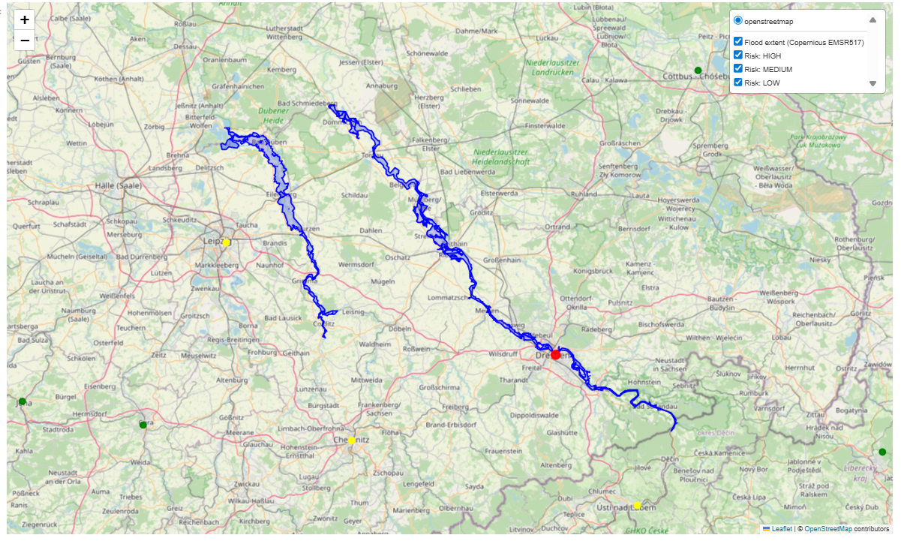
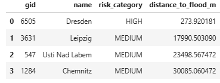

# Flood Risk Exposure WebGIS (PostGIS + Python)

## Project Overview

This project performs **spatial flood risk analysis** using **PostGIS, Python, and real-world geospatial datasets**.
It analyzes which populated places are exposed to flooding based on distance from flood extent polygons and visualizes the results on an interactive web map.

The workflow uses:

* **PostGIS** for spatial SQL analysis
* **GeoPandas** for geospatial data processing
* **SQLAlchemy** for database connection
* **Folium / Leaflet** for interactive WebGIS visualization


## Flood Analysis Map



---


## Data Sources

This project uses open geospatial datasets:

* **Copernicus Emergency Management Service (EMSR517)**
  Flood delineation polygons from the July 2021 Western Europe floods.

* **Natural Earth**

  * Admin 0 Countries dataset
  * Populated Places dataset

---

## Project Structure

```
project/
│
├── config/
│   └── config.py              # dataset URLs and project settings
│
├── data/
│   └── raw/                   # downloaded datasets (not tracked in Git)
│
├── docs/
│   ├── flood_risk_map.html
│   ├── flood_vulnerability_top50_emsr517.csv
│   └── README_metrics.md
│
├── flood_analysis.ipynb       # main analysis notebook
└── requirements.txt
```

---

## Workflow

### 1. Download datasets

The notebook downloads:

* Natural Earth **countries**
* Natural Earth **populated places**
* Copernicus **flood delineation dataset**

Datasets are extracted into:

```
data/raw/
```

---

### 2. Load data into PostGIS

GeoPandas loads the shapefiles and inserts them into PostgreSQL tables:

* `countries`
* `places`
* `flood_extent_emsr517`

---

### 3. Spatial Analysis

PostGIS is used to compute flood exposure:

* `ST_Intersects` – detect places inside flood polygons
* `ST_Distance` – compute distance from flood
* `ST_DWithin` – detect places near flood

Risk levels are assigned:

| Risk Level | Definition             |
| ---------- | ---------------------- |
| HIGH       | Inside flood polygon   |
| MEDIUM     | Within 0–2 km of flood |
| LOW        | Within 2–5 km of flood |
| MINIMAL    | More than 5 km away    |

---

### 4. Hazard Bands

Two hazard zones are created:

* **0–2 km buffer**
* **2–5 km ring buffer**

Using PostGIS:

* `ST_Buffer`
* `ST_Difference`

---

### 5. Risk Table

Main output table:

```
places_flood_risk
```

Contains:

* place name
* population
* distance to flood
* risk category
* risk score

---

### 6. Visualization

An interactive map is generated using **Folium** showing:

* flood extent polygons
* hazard distance bands
* populated places
* risk levels

The map is exported to:

```
docs/flood_risk_map.html
```

---

## Results

Example outputs include:

* `flood_risk_summary_emsr517`
* `flood_vulnerability_top50_emsr517`
* `docs/flood_vulnerability_top50_emsr517.csv`

These show the **most vulnerable populated places near the flood area**.

---

## Installation

Install dependencies:

```
pip install -r requirements.txt
```

---

## Run the Project

Open and run the notebook:

```
flood_analysis.ipynb
```

The notebook will:

1. Download datasets
2. Load data into PostGIS
3. Perform spatial analysis
4. Generate flood exposure results
5. Export interactive maps and reports

---

## Technologies Used

* PostgreSQL + PostGIS
* Python
* GeoPandas
* SQLAlchemy
* Folium
* Natural Earth datasets
* Copernicus EMS flood data

---

## License

This project uses open datasets and is intended for educational and research purposes.
